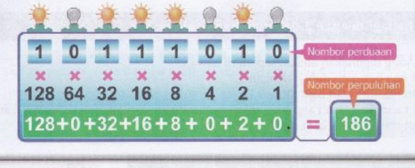
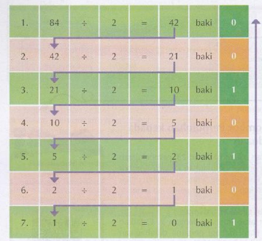

 
## Bab 2: Pewakiran Data  

### 2.1 - Sistem Perduaan dan Sistem Perpuluhan  

#### 2.1.1 - Decimal Systems (Sistem perpuluhan)
- Decimal Systems (Sistem Perpuluhan) is a number system.  
- We use decimal systems everyday for mathematic calculations 
- It is referred to Base 10 (Asas 10)  
- It has 10 numbers (0 to 9)  

#### 2.1.2 - Binary Systems (System perduaan)

-  Binary System (Sistem Perudaan) is a number system  
- Computers generally ONLY understand binary systems, it dosn't know what is decimal systems.  
- It is reffered to Base 2 (Asas 2)  
- It has 2 numbers, 0 and 1  
- 0 in this number system is OFF and vice versa (1 = ON)  
- Computer programs have a set of instructions.  
- Those instructions are translated into binary system so that the CPU (in simple terms the processing unit) can process the instructions then follow it.
- As Example: music, documents, files etc. are kept using binary system

#### 2.1.3 - How to find a value
The way to find a value

Example: Wat is the way u get the value 2017 in decimal systems?

Format:
```
--------------------------------
| 10³  | 10²  | 10¹  | 10⁰  |
--------------------------------
| 1000 | 100  |  10  |  1   |
--------------------------------
|      |      |      |      |
--------------------------------
```

now u white the value given in the question in the 3rd row.

```
--------------------------------
| 10³  | 10²  | 10¹  | 10⁰  |
--------------------------------
| 1000 | 100  |  10  |  1   |
--------------------------------
|  2   |   0  |   1  |  7   |
--------------------------------
```

now u multiply 2nd and 3rd row then add them all up

```
2 x 1000 = 2000
0 x 100 = 0
1 x 10 = 10
7 x 1 = 7

2000+0+10+7 = 2017
```

in exam u write it like this

```
--------------------------------
| 10³  | 10²  | 10¹  | 10⁰  |
--------------------------------
| 1000 | 100  |  10  |  1   |
--------------------------------
|  2   |   0  |   1  |  7   |
--------------------------------

2 x 1000 = 2000
0 x 100 = 0
1 x 10 = 10
7 x 1 = 7

2000+0+10+7 = 2017
```

Now try to find the value 2023 with the method above


### 2.2 - Conversion
#### 2.2.1 - Convertion (Binary to Decimal)

Format:

```
------------------------
| 2³ | 2² | 2¹ | 2⁰ |
------------------------
|  8  |  4  |  2  |  1 |
------------------------
|     |     |     |    |
------------------------

```

Contoh: Apakah nilai digit 1011 dalam sistem perpuluhan?
Example: What is the value of 1011 in decimal systems?

so u tulis nombor perduaan yg diberi dalam soalan ke barisan ke-3
so u write the binary digits given by the question to 3rd row

```
------------------------
| 2³ | 2² | 2¹ | 2⁰ |
------------------------
|  8  |  4  |  2  |  1 |
------------------------
| 1  | 0  | 1  | 1 |
------------------------
```

sekarang u darat barisan ke-2 dan ke-3 lalu tambah itu.
now u multiply 2nd and 3rd row then add them up.

```
8 x 1 = 8
4 x 0 = 0
2 x 1 = 2
1 x 1 = 1

8+0+2+1 = 11
```

so dalam pemeriksaan kamu tulis macam ini
so when u in exam u write like this

```
------------------------
| 2³ | 2² | 2¹ | 2⁰ |
------------------------
|  8  |  4  |  2  |  1 |
------------------------
| 1  | 0  | 1  | 1 |
------------------------

8 x 1 = 8
4 x 0 = 0
2 x 1 = 2
1 x 1 = 1

8+0+2+1 = 11
```


#### 2.2.2 - Conversion (Decimal to Binary)


this is kaedah ambil daripada baki.

Format:
```
----------------------------------------------
| 128 | 64 | 32 | 16 | 8 | 4 | 2 | 1 |
----------------------------------------------
|     |    |    |    |   |   |   |   |
----------------------------------------------

```

this very ez when u understnad.

Example: change decimal system number 84 to binary system.

1. Start with the given decimal number (84).
2. Look at the first row, starting from the most left column (128).
3. Subtract the value in the column (84 - 128 = -44). Because its a negative result, write down 0 below the column.
4. Subtract the value in the column (84 - 64 = 20). Because its a positive number, we write 1 below the column.
5. Move to the next column on the right (32).
6. Subtract the value in the column from the previous result (20 - 16 = 4). Positive number, write down 1 below the column.
7. Continue this process for the remaining columns, subtracting the value from the previous result if it's possible.
8. If the subtraction is possible, write down a 1 below the column. If not, write down a 0.
9. After going through all the columns, complete the binary representation by writing down 0s for any remaining empty columns.

```
----------------------------------------------
| 128 | 64 | 32 | 16 | 8 | 4 | 2 | 1 |
----------------------------------------------
|  0  |    |    |    |   |   |   |   |
----------------------------------------------
```

```
----------------------------------------------
| 128 | 64 | 32 | 16 | 8 | 4 | 2 | 1 |
----------------------------------------------
|   0 | 1  |    |    |   |   |   |   |
----------------------------------------------

```

```
----------------------------------------------
| 128 | 64 | 32 | 16 | 8 | 4 | 2 | 1 |
----------------------------------------------
|   0 | 1  |  0 |    |   |   |   |   |
----------------------------------------------
```

```
----------------------------------------------
| 128 | 64 | 32 | 16 | 8 | 4 | 2 | 1 |
----------------------------------------------
|   0 | 1  |  0 |  1 |   |   |   |   |
----------------------------------------------
```

```
----------------------------------------------
| 128 | 64 | 32 | 16 | 8 | 4 | 2 | 1 |
----------------------------------------------
|   0 | 1  |  0 |  1 | 0 |   |   |   |
----------------------------------------------
```

```
----------------------------------------------
| 128 | 64 | 32 | 16 | 8 | 4 | 2 | 1 |
----------------------------------------------
|   0 | 1  |  0 |  1 | 0 | 1 |   |   |
----------------------------------------------
```

```
----------------------------------------------
| 128 | 64 | 32 | 16 | 8 | 4 | 2 | 1 |
----------------------------------------------
|   0 | 1  |  0 |  1 | 0 | 1 | 0 | 0 |
----------------------------------------------
```

answer: 01011100

video: 
["Click Me!"](https://drive.google.com/file/d/1ddvsZ99gazHuyAL9SdqZdMLvAqsEbFgy/view?usp=sharing)


#### 2.2.3 - Kaedah lain-lain untuk tukaran
More ways

##### Binary to Decimal

Format:


this wat it look after finished



if light is on put 1 if light off put 0

##### Decimal to Binary

Kaedah bahagi dengan 2 dan guna bakinya

Steps:
1. Divide the number given by 2
2. write the result and the 余数 (if got 余数 then write 1 if no then write 0)
3. repeat divide till u get the result 0
4. write the 余数 (0 and 1) from down to up



(arrows are just copy the answer from point a to point b)


#### 2.2.4 - IMPORTANT! (Kaedah ambil dari baki steps)
Alright this is a very imporant topic cuz exam might ask this

If you dont remember, its this:
Steps:
1. Divide the number given by 2
2. write the result and the 余数 (if got 余数 then write 1 if no then write 0)
3. repeat divide till u get the result 0
4. write the 余数 (0 and 1) from down to up
![[Pasted image 20230527131749.png]]

Example Question:
```
Tunjukkan langkah yg lengkap dlm Peta Alir di bawah bagi menukarkan nombor perpuluhan, iaitu 41 kepada nombor perduaan dengan menggunakan kaedah ambil daripada baki.

Show the FULL way in the IThink map below how to change 41 (decimal system) to binary system using kaedah ambil drpd baki.

32|16|8|4|2|1
  |  | | | |
```

Alright first u gotta turn 41 to binary system as usual

```
1. Start with the given decimal number (41).
2. Look at the first row, starting from the most left column (32).
3. Subtract the value in the column (41-32 = 9). Because its a positive result, write down 1 below the column.
4. Move to the next column on the right (16)
5. Subtract the value in the column from the previous positive result (9 - 16 = -7). Because its a negative number, we write 0 below the column.
6. Move to the next column on the right (8).
7. Subtract the value in the column from the previous positive number result (9 - 8 = 1). Positive number, write down 1 below the column.
8. Move on to the next column (4)
9. Subtract the value in the column from the previous positive result (1 - 4 = -3). Negative numebr, write 0 below the column
10. MOve on to next column (2)
11. Subtract the value in the column from the prevoius positive result (1 - 2 = -1). Negative number, write 0 below the column
12. Move on to last column (1)
13. Subtract the value in the column from the prevoius positive result (1 - 1 = 0). Still considered as a positive result, write 1 below the column.

No more columns!
```

Now you should have something like this:

32  16  8  4  2  1
1    0  1  0  0  1

Format:
```
(x) (dapat/tidak boleh) diambil daripada (y), maka tempatkan (1/0) pada lajar nilai tempatan (x) [dan tolakkan (y) dan (x), iaitu (y) - (x) = (answer for that)]

x = 1st row's column
y = the decimal system number
dapat/tidak boleh: 
if y - x = negative number, put tidak dapat
if y - x = positive number, put dapat
1/0:
if y - x = negative number, put 0
if y - x = positive number, put 1

PS: the content in [] is written when dapat is choosen
PS: if (answer for that) is positive number, it will automaticlly become the next y
```

Alright ik its confusing, lets just start

so lets use our format to create our 1st step:

```
We start with the most-right column (32)

x = first row column (32)
y = decimal system number (41)
dapat/tidak dapat:
41-32 = 9
Positive number, so we choose dapat
1/0:
41 - 32 = 9
Positive number, so we choose 1
```

1st step:
```
(32) (dapat) diambil daripada (41), maka tempatkan 1 pada lajar nilai tempatan (32) [dan tolakkan (41) dan (32), iaitu 41 - 32 = 9 (answer for that)].

PS: 
if (answer for that) is a positive number, it is (y) now
if (answer for that) is a negative number, we dont change (y)

so now 9 is positive number, it is (y) now
```

create our 2nd step:
```
Now we move on to the left of the first column (16)

x = first row column (16)
y = decimal system number (9)
dapat/tidak dapat:
9 - 16 = -7
Negative number, so we use tidak dapat
1/0:
9 - 16 = -7
Negative number, so we use 0

PS: on first step i mentioned now 9 is y, thats why y is now 9
```

2nd step:
```
(16) (tidak dapat) diambil daripada (9), maka tempatkan 1 pada lajar nilai tempatan (16) [dan tolakkan (9) dan (16), iaitu 9 - 16 = -7 (answer for that)]

PS:
(answer for that) is a negative number, so (y) is still 9
```

This is actually on ur ask paper pg 4. So now do it!

### 2.3 - Mathematical Operations on binary

#### 2.3.1 - The Logic
This is very easy only if you get how it works so thats why im explaining the concept.

So lets say a example you need to do 01 + 01, heres how i understand.

01 in decimal numbers is 1 so its just 1 + 1.
1 + 1 = 2 (decimal number)
then we convert 2 back to binary which is 10.

Thats the logic behind why 1+1 = 10 in binary.
#### 2.3.2 - Adding

So you need to remember somethings before doing math on binary

0 + 0 = 0
0+1=1
1+0 = 1
1+1=10
10+1=11

##### Example Question: 100 + 101

```
  100
+ 101
------

```

Like normal math we add from right to left

0 + 1 = 1
```
  100
+ 101
------
    1
```

0 + 0 = 0

```
  100
+ 101
------
   01
```

1+1 = 10
```
  100
+ 101
------
  1001
```

done!

##### Special Case #1

```
   1010
+  1010
--------

```

0+0 = 0
```
   1010
+  1010
--------
      0
```

1+1 = 10
like normal math u add a small 1 on the next number then put the 0 where the results are

```
    1
   1010
+  1010
--------
     00
```

1+0+0 = 1
```
    1
   1010
+  1010
--------
    100
```

1+1 = 10
```
    1
   1010
+  1010
--------
  10100
```

##### Special Case #2
Lets say another case where you get 0110 + 1111

```
  0110
+ 1111
--------

```
0+1 = 1
```
  0110
+ 1111
--------
     1
```
1+1 = 10
```
   1
  0110
+ 1111
--------
    01
```
1+1+1 = 10 + 1
			= 11

```
  11
  0110
+ 1111
--------
   101
```
1+0+1 = 10
```
  11
  0110
+ 1111
--------
 
 
 
 
 10101
```


Now try 01010011+01110110
#### 2.3.3 - Subtraction
things to remember:
0-0 = 0
1-0 = 1
1-1 = 0
10 - 1 = 1

Almost same with basic math but just need to follow the rules above

##### Example: 1010 - 1001

```
  1010
- 1001
---------
 
```

Now like normal math u are required to borrow if 0 - 1

```
     10
  1010
- 1001
---------
 
```

10-1 = 1
```
     10
  1010
- 1001
---------
     1
```

1-0 = 1
```
     10
  1010
- 1001
---------
    11
```

0-0 = 0
```
     10
  1010
- 1001
---------
   011
```

1-1 = 0
```
     10
  1010
- 1001
---------
   0011
```

d o n e

Now try 11010110 - 110011


### 2.4 - ASCII

Alright we are approaching the difficult zone. Get ready.

#### What is ASCII

- ASCII stands for "American Standard Code for Information Interchange"
- ASCII is a set of codes that represents everyone characters and symbols in English.
- ASCII of course uses binary system.
- ASCII uses binary system to represent every character, symbol, number etc.
- ASCII code represents 128 characters and enought for english uses.
- ASCII is used in alot in computers.
- Your keyboard uses ASCII to send 0 and 1 to the cpu to let the cpu proses then display it on the monitor (when you are typing)


#### ASCII table

The ASCII table is located on page 35 of your textbook.

```
Decimal   Binary      Character
33        00100001    !
34        00100010    "
35        00100011    #
36        00100100    $
37        00100101    %
38        00100110    &
39        00100111    '
40        00101000    (
41        00101001    )
42        00101010    *
43        00101011    +
44        00101100    ,
45        00101101    -
46        00101110    .
47        00101111    /
48        00110000    0
49        00110001    1
50        00110010    2
51        00110011    3
52        00110100    4
53        00110101    5
54        00110110    6
55        00110111    7
56        00111000    8
57        00111001    9
58        00111010    :
59        00111011    ;
60        00111100    <
61        00111101    =
62        00111110    >
63        00111111    ?
64        01000000    @
65        01000001    A
66        01000010    B
67        01000011    C
68        01000100    D
69        01000101    E
70        01000110    F
71        01000111    G
72        01001000    H
73        01001001    I
74        01001010    J
75        01001011    K
76        01001100    L
77        01001101    M
78        01001110    N
79        01001111    O
80        01010000    P
81        01010001    Q
82        01010010    R
83        01010011    S
84        01010100    T
85        01010101    U
86        01010110    V
87        01010111    W
88        01011000    X
89        01011001    Y
90        01011010    Z
91        01011011    [
92        01011100    \
93        01011101    ]
94        01011110    ^
95        01011111    _
96        01100000    `
97        01100001    a
98        01100010    b
99        01100011    c
100       01100100    d
101       01100101    e
102       01100110    f
103       01100111    g
104       01101000    h
105       01101001    i
106       01101010    j
107       01101011    k
108       01101100    l
109       01101101    m
110       01101110    n
111       01101111    o
112       01110000    p
113       01110001    q
114       01110010    r
115       01110011    s
116       01110100    t
117       01110101    u
118       01110110    v
119       01110111    w
120       01111000    x
121       01111001    y
122       01111010    z
123       01111011    {
124       01111100    |
125       01111101    }
126       01111110    ~
```
