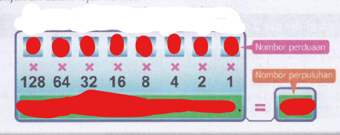
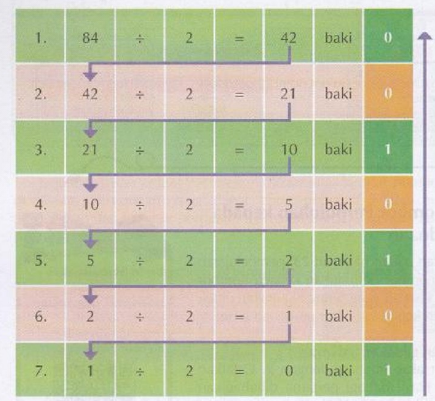

## More ways of conversion

##### Binary to Decimal

Format:

this wat it look after finished

if light is on put 1 if light off put 0

##### Decimal to Binary

Kaedah bahagi dengan 2 dan guna bakinya

Steps:
1. Divide the number given by 2
2. write the result and the 余数 (if got 余数 then write 1 if no then write 0)
3. repeat divide till u get the result 0
4. write the 余数 (0 and 1) from down to up

(arrows are just copy the answer from point a to point b)

[Click me to go to next page!](/English/2.2.4.md "target=_self")