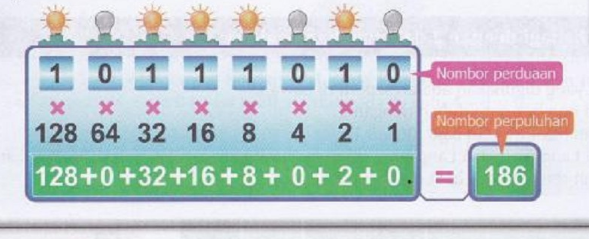

## Bab 2: Pewakiran Data  

### 2.1 - Sistem Perduaan dan Sistem Perpuluhan

#### 2.1.1 - Sistem Perpuluhan (Decimal Systems)
- Sistem Perpuluhan (decimal systems) ialah satu nombor sistem.
- Kami menggunakan sistem perpuluhan pada setiap hari (0-9). 
- Kami boleh pangil sistem perpuluhan dengan asas 10 (Base 10). 
- Sistem perpuluhan ada sepuluh nomber, iaitu 0 hingga 9  

##### Sistem Perduaan (Binary Systems)  
- Sistem Perduaan (Binary System) ialah satu nomber sistem.  
- Komputer tahu sistem perduaan SAHAJA, komputer tak tahu apa sistem perpuluhan.  
- Kami boleh panggil sistem perduaan dengan asas 2 (Base 2)  
- Sistem perduaan ada dua nombor sahaja, iaitu 0 dan 1  
- 0 dlm sistem nombor ini ialah tutup (off)  
- 1 dlm sistem nombor ini ialah Buka (on)  
- Suatu program komputer adalah satu set arahan di kod itu.  
-  Setiap set arahan akan diterjemahkan kpd kod mesin yg menggunakan kod nomber perduaan supaya unit pemprosesan (CPU) boleh melaksanakannya.  
- Sebagai Contoh, perisian, musiz, dokumen dan sbgnya disimpan dlm nomber perduaan.  

#### 2.1.2 - Sistem perduaan (Binary Systems)

- Sistem Perudaan (Binary System) adalah sistem nombor.
- Komputer pada umumnya HANYA memahami sistem perudaan, ia tidak mengenal sistem perpuluhan.
- Sistem ini merujuk pada Asas 2 (Base 2).
- Terdapat 2 nombor dalam sistem ini, yaitu 0 dan 1.
- Angka 0 dalam sistem ini menandakan mati (OFF), dan sebaliknya (1 = hidup (ON)).
- Program komputer memiliki serangkaian arahan.
- Arahan tersebut diterjemahkan ke dalam sistem perudaan agar CPU (unit pemrosesan) dapat memproses arahan tersebut dan mengikutinya.
- Sebagai contoh: musik, dokumen, file, dan sebagainya disimpan menggunakan sistem perudaan.
#### 2.1.3 - Cara untuk mencari nilai perpuluhan

Contoh: Apakah cara mendapat nilai 2017 dlm sistem perpuluhan?

Format:
```
--------------------------------
| 10³  | 10²  | 10¹  | 10⁰  |
--------------------------------
| 1000 | 100  |  10  |  1   |
--------------------------------
|      |      |      |      |
--------------------------------
```

u menulis nilai yg diberikan dari soalan ke barisan ke-3.

```
--------------------------------
| 10³  | 10²  | 10¹  | 10⁰  |
--------------------------------
| 1000 | 100  |  10  |  1   |
--------------------------------
|  2   |   0  |   1  |  7   |
--------------------------------
```

ok sekarang u darat baris ke-2 dan baris ke-3 lalu tambah itu

```
2 x 1000 = 2000
0 x 100 = 0
1 x 10 = 10
7 x 1 = 7

2000+0+10+7 = 2017
```

ok dalam pemeriksaan u tulis macam ini
```
--------------------------------
| 10³  | 10²  | 10¹  | 10⁰  |
--------------------------------
| 1000 | 100  |  10  |  1   |
--------------------------------
|  2   |   0  |   1  |  7   |
--------------------------------

2 x 1000 = 2000
0 x 100 = 0
1 x 10 = 10
7 x 1 = 7

2000+0+10+7 = 2017
```

Cuba mencari nilai 2023 dengan cara ini!


### 2.2 - Tukaran
#### 2.2.1 - Tukar dari nombor perduaan ke perpuluhan

Format:

```
------------------------
| 2³ | 2² | 2¹ | 2⁰ |
------------------------
|  8  |  4  |  2  |  1 |
------------------------
|     |     |     |    |
------------------------

```

Contoh: Apakah nilai digit 1011 dalam sistem perpuluhan?

so u tulis nombor perduaan yg diberi dalam soalan ke barisan ke-3

```
------------------------
| 2³ | 2² | 2¹ | 2⁰ |
------------------------
|  8  |  4  |  2  |  1 |
------------------------
| 1  | 0  | 1  | 1 |
------------------------
```

sekarang u darat barisan ke-2 dan ke-3 lalu tambah itu.

```
8 x 1 = 8
4 x 0 = 0
2 x 1 = 2
1 x 1 = 1

8+0+2+1 = 11
```

so dalam pemeriksaan kamu tulis macam ini

```
------------------------
| 2³ | 2² | 2¹ | 2⁰ |
------------------------
|  8  |  4  |  2  |  1 |
------------------------
| 1  | 0  | 1  | 1 |
------------------------

8 x 1 = 8
4 x 0 = 0
2 x 1 = 2
1 x 1 = 1

8+0+2+1 = 11
```

#### 2.2.2 - Tukar dari nombor perpuluhan ke perduaan

Ini kaedah ambil daripada baki.

Format:
```
----------------------------------------------
| 128 | 64 | 32 | 16 | 8 | 4 | 2 | 1 |
----------------------------------------------
|     |    |    |    |   |   |   |   |
----------------------------------------------

```

ok ini sangat senang jika kamu tahu

Soalan: tukarkan nomber perpuluhan 84 kepada nombor perduaan.

1. Mula dengan nombor perpuluhan yang diberikan (84).
2. Lihat pada baris pertama, bermula dari lajur paling kiri (128).
3. Tolak nilai dalam lajur tersebut (84 - 128 = -44). Kerana ia adalah hasil negatif, tulis 0 di bawah lajur tersebut.
4. Tolak nilai dalam lajur tersebut (84 - 64 = 20). Kerana ia adalah nombor positif, tulis 1 di bawah lajur tersebut.
5. Gerak ke lajur seterusnya di sebelah kanan (32).
6. Tolak nilai dalam lajur tersebut daripada hasil sebelumnya (20 - 16 = 4). Nombor positif, tulis 1 di bawah lajur tersebut.
7. Teruskan proses ini untuk lajur yang tinggal, dengan menjalankan pengurangan nilai daripada hasil sebelumnya jika ia memungkinkan.
8. Jika pengurangan adalah memungkinkan, tulis 1 di bawah lajur tersebut. Jika tidak, tulis 0.
9. Selepas melalui semua lajur, lengkapkan representasi nombor perduaan dengan menulis 0 untuk sebarang lajur kosong yang tinggal.

```
----------------------------------------------
| 128 | 64 | 32 | 16 | 8 | 4 | 2 | 1 |
----------------------------------------------
|  0  |    |    |    |   |   |   |   |
----------------------------------------------
```

```
----------------------------------------------
| 128 | 64 | 32 | 16 | 8 | 4 | 2 | 1 |
----------------------------------------------
|   0 | 1  |    |    |   |   |   |   |
----------------------------------------------

```

```
----------------------------------------------
| 128 | 64 | 32 | 16 | 8 | 4 | 2 | 1 |
----------------------------------------------
|   0 | 1  |  0 |    |   |   |   |   |
----------------------------------------------
```

```
----------------------------------------------
| 128 | 64 | 32 | 16 | 8 | 4 | 2 | 1 |
----------------------------------------------
|   0 | 1  |  0 |  1 |   |   |   |   |
----------------------------------------------
```

```
----------------------------------------------
| 128 | 64 | 32 | 16 | 8 | 4 | 2 | 1 |
----------------------------------------------
|   0 | 1  |  0 |  1 | 0 |   |   |   |
----------------------------------------------
```

```
----------------------------------------------
| 128 | 64 | 32 | 16 | 8 | 4 | 2 | 1 |
----------------------------------------------
|   0 | 1  |  0 |  1 | 0 | 1 |   |   |
----------------------------------------------
```

```
----------------------------------------------
| 128 | 64 | 32 | 16 | 8 | 4 | 2 | 1 |
----------------------------------------------
|   0 | 1  |  0 |  1 | 0 | 1 | 0 | 0 |
----------------------------------------------
```
so jawapan ialah 01011100
answer: 01011100

video: 
["Klick Saya!"](https://drive.google.com/file/d/1ddvsZ99gazHuyAL9SdqZdMLvAqsEbFgy/view?usp=sharing)

#### 2.2.3 - Kaedah Lain
##### Perduaan ke perpuluhan

Format:


lengkap



lampu yg buka u tulis 1 yg tutup tulis 0

##### Perpuluhan ke Perduaan

Kaedah bahagi dengan 2 dan guna bakinya

Langkah-langkah:

1. Bahagi nombor perpuluhan dengan 2
2. Tuliskn hasilnya dan baki (jika ada baki tulis 1 jika tak ada tulis 0)
3. ulangi langkah 1 dan 2 hingga hasil bahagi tidak boleh dibahagi lagi (sehingga 0 lah)
4. tulis semula hasil baki dari bawah ke atas.


(arrows are just copy the answer from point a to point b)


#### 2.2.4 - PENTING (Pemeriksaan mungkin aada soalan ini)

Soalan:
``` 
Tunjukkan langkah yg lengkap dlm Peta Alir di bawah bagi menukarkan nombor perpuluhan, iaitu 41 kepada nombor perduaan dengan menggunakan kaedah ambil daripada baki.

|32|16|8|4|2|1
|  |  | | | |

(Ini dalam kertas ask kamu)
```

Baik, pertama-tama Anda harus menukar 41 ke sistem perduaan seperti biasa.
```
1. Mulailah dengan nombor perpuluhan yang diberikan (41).
2. Lihat pada baris pertama, mulai dari kolom paling kiri (32).
3. Kurangkan nilai pada kolom tersebut (41-32 = 9). Karena hasilnya positif, tuliskan angka 1 di bawah kolom tersebut.
4. Pindah ke kolom berikutnya di sebelah kanan (16).
5. Kurangkan nilai pada kolom tersebut dari hasil positif sebelumnya (9 - 16 = -7). Karena angka tersebut negatif, tuliskan angka 0 di bawah kolom tersebut.
6. Pindah ke kolom berikutnya di sebelah kanan (8).
7. Kurangkan nilai pada kolom tersebut dari hasil positif sebelumnya (9 - 8 = 1). Angka tersebut positif, tuliskan angka 1 di bawah kolom tersebut.
8. Lanjutkan ke kolom berikutnya (4).
9. Kurangkan nilai pada kolom tersebut dari hasil positif sebelumnya (1 - 4 = -3). Angka tersebut negatif, tuliskan angka 0 di bawah kolom tersebut.
10. Lanjutkan ke kolom berikutnya (2).
11. Kurangkan nilai pada kolom tersebut dari hasil positif sebelumnya (1 - 2 = -1). Angka tersebut negatif, tuliskan angka 0 di bawah kolom tersebut.
12. Lanjutkan ke kolom terakhir (1).
13. Kurangkan nilai pada kolom tersebut dari hasil positif sebelumnya (1 - 1 = 0). Karena masih dianggap hasil positif, tuliskan angka 1 di bawah kolom tersebut.
```

Ok jika kamu mengikut langkah di atas, u ada ini sekarang

```
32  16  8  4  2  1
 1    0  1  0  0  1

```

Format:
```
(x) (dapat/tidak dapat) diambil daripada (y), maka tempatkan (1/0) pada lajur nilai tempatan (x) [dan tolakkan (y) dan (x), iaitu (y) - (x) = (jawaban untuk itu)]

x = kolom baris pertama
y = nombor sistem perpuluhan
dapat/tidak dapat:
jika y - x = nombor negatif, menggunakan tidak dapat
jika y - x = nombor positif, menggunakan dapat
1/0:
jika y - x = nombor negatif, tuliskan 0
jika y - x = nombor positif, tuliskan 1

PS: isi yg ada [] ditulis ketika kami menggunakan dapat
PS: jika (jawaban untuk itu) ialah nombor positif, jawaban itu menjadi y

```

Mari kita gunakan format tersebut untuk membuat langkah pertama:
```
Kita mulai dengan kolom paling kanan (32)

x = kolom baris pertama (32)
y = nombor sistem perpuluhan (41)
dapat/tidak dapat:
41 - 32 = 9
nombor positif, jadi kita pilih dapat

1/0:
41 - 32 = 9
nombor positif, jadi kita pilih 1
```

Jawapan (tak paya tulis PS:):
```
(32) (dapat) diambil daripada (41), maka tempatkan 1 pada lajur nilai tempatan (32) [dan tolakkan (41) dan (32), iaitu 41 - 32 = 9 (jawaban untuk itu)].


PS: jika (jawaban untuk itu) ialah nombor positif, jawaban itu menjadi y
	so 9 adalah nombor positif, 9 menjadi y
```

Siap langkah 1!

Mari kita buat langkah kedua:
```
Sekarang kita pindah ke sebelah kiri kolom pertama (16)

x = kolom baris pertama (16)
y = nombor sistem desimal (9)
dapat/tidak dapat:
9 - 16 = -7
Nombor negatif, jadi kita gunakan tidak dapat

1/0:
9 - 16 = -7
Nombor negatif, jadi kita gunakan 0

PS: pada langkah pertama saya sebutkan sekarang 9 adalah y, itulah mengapa y sekarang 9
```

Jawapan (tak paya tulis PS:)
```
(16) (tidak dapat) diambil daripada (9), maka tempatkan 1 pada lajur nilai tempatan (16) [dan tolakkan (9) dan (16), iaitu 9 - 16 = -7 (jawaban untuk itu)]

PS: (jawaban untuk itu) adalah nombor negatif, jadi (y) masih 9
```

Langkah 2 siap!

### 2.3 - Penambahan dan Penolakan nombor perduaan

#### 2.3.1 - Logik
  
Ini sangat mudah jika Anda memahami cara kerjanya, oleh karena itu saya akan menjelaskan logiknya.

Mari kita ambil contoh: Anda perlu menjumlahkan 01 + 01, ini logik saya:

01 dalam nombor perpuluhan adalah 1, jadi ini hanya 1 + 1.

1 + 1 = 2 (nombor perpuluhan) 
Kemudian kita tukar 2 ke sistem perudaan, yang mana adalah 10.

Itulah logika di balik mengapa 1 + 1 = 10 dalam sistem perudaan.


#### 2.3.2 - Penambahan
Anda perlu mengingat beberapa hal sebelum melakukan operasi matematika pada sistem perudaan.

0 + 0 = 0
0 + 1 = 1
1 + 0 = 1
1 + 1 = 10
10 + 1 = 11

##### Contoh Pertanyaan: 100 + 101
```
  100
+ 101
------

```

Seperti matematika biasa, kita menjumlahkan dari kanan ke kiri.

0 + 1 = 1
```
  100
+ 101
------
    1

```

0+0 = 0
```
  100
+ 101
------
   01

```

1+1 = 10
```
  100
+ 101
------
  1001

```

Selesai!

##### Kasus Khusus #1

```
   1010
+  1010
--------

```

0+0 = 0
```
   1010
+  1010
--------
      0

```

1 + 1 = 10
Seperti matematika biasa, u menulis kecil 1 di atas nombor yg ke kanan dan tulis 0 di tempat hasil

```
    1
   1010
+  1010
--------
     00

```

1 + 0 + 0 = 1

```
    1
   1010
+  1010
--------
    100

```

1+1=10
```
    1
   1010
+  1010
--------
  10100

```

Selasai!
##### Kasus Khusus #2

```
  0110
+ 1111
--------

```

0 + 1 = 1
```
  0110
+ 1111
--------
     1
```

1+1 = 10
```
   1
  0110
+ 1111
--------
    01
```

1 + 1 + 1
= 10 + 1
= 11

```
  11
  0110
+ 1111
--------
   101

```

1+0+1 = 10
```
  11
  0110
+ 1111
--------
 10101

```

Siap!

Cuba 01010011 + 01110110.
#### 2.3.3 - Penolakkan

Aturan yg wajib diingat:
0 - 0 = 0
1 - 0 = 1
1 - 1 = 0
10 - 1 = 1

Hampir sama dengan matematika biasa, tetapi u mesti mengikuti aturan di atas.

##### Contoh: 1010 - 1001

```
  1010
- 1001
---------
 
```

seperti matematika biasa, Anda boleh meminjam nombor jika  0 - 1.

```
     10
  1010
- 1001
---------
 

```

10-1 = 1
```
     10
  1010
- 1001
---------
     1

```

1-0 = 1
```
     10
  1010
- 1001
---------
    11

```

0-0 = 0
```
     10
  1010
- 1001
---------
   011

```

1-1 = 0
```
     10
  1010
- 1001
---------
   0011

```

s i a p!


Cuba 11010110 - 110011 sekarang!


#### 2.4 - ASCII

Ok ini sedikit susah lah.

##### Apakah itu ASCII?

- ASCII merujuk kepada "American Standard Code for Information Interchange".
- ASCII adalah satu set kod yang mewakili semua aksara.
- ASCII menggunakan sistem binari.
- ASCII menggunakan sistem binari untuk mewakili setiap aksara.
- Kod ASCII mewakili 128 aksara dan mencukupi untuk kegunaan bahasa Inggeris.
- ASCII digunakan secara meluas dalam komputer.
- Keyboard anda menggunakan ASCII untuk menghantar 0 dan 1 kepada unit pemprosesan(CPU) untuk diproses dan dipaparkan di monitor

##### list ASCII

List ini dari buku teks m/s 35

```
Decimal   Binary      Character
33        00100001    !
34        00100010    "
35        00100011    #
36        00100100    $
37        00100101    %
38        00100110    &
39        00100111    '
40        00101000    (
41        00101001    )
42        00101010    *
43        00101011    +
44        00101100    ,
45        00101101    -
46        00101110    .
47        00101111    /
48        00110000    0
49        00110001    1
50        00110010    2
51        00110011    3
52        00110100    4
53        00110101    5
54        00110110    6
55        00110111    7
56        00111000    8
57        00111001    9
58        00111010    :
59        00111011    ;
60        00111100    <
61        00111101    =
62        00111110    >
63        00111111    ?
64        01000000    @
65        01000001    A
66        01000010    B
67        01000011    C
68        01000100    D
69        01000101    E
70        01000110    F
71        01000111    G
72        01001000    H
73        01001001    I
74        01001010    J
75        01001011    K
76        01001100    L
77        01001101    M
78        01001110    N
79        01001111    O
80        01010000    P
81        01010001    Q
82        01010010    R
83        01010011    S
84        01010100    T
85        01010101    U
86        01010110    V
87        01010111    W
88        01011000    X
89        01011001    Y
90        01011010    Z
91        01011011    [
92        01011100    \
93        01011101    ]
94        01011110    ^
95        01011111    _
96        01100000    `
97        01100001    a
98        01100010    b
99        01100011    c
100       01100100    d
101       01100101    e
102       01100110    f
103       01100111    g
104       01101000    h
105       01101001    i
106       01101010    j
107       01101011    k
108       01101100    l
109       01101101    m
110       01101110    n
111       01101111    o
112       01110000    p
113       01110001    q
114       01110010    r
115       01110011    s
116       01110100    t
117       01110101    u
118       01110110    v
119       01110111    w
120       01111000    x
121       01111001    y
122       01111010    z
123       01111011    {
124       01111100    |
125       01111101    }
126       01111110    ~
```
